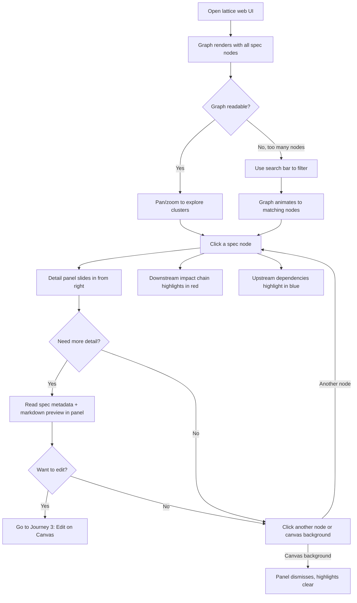
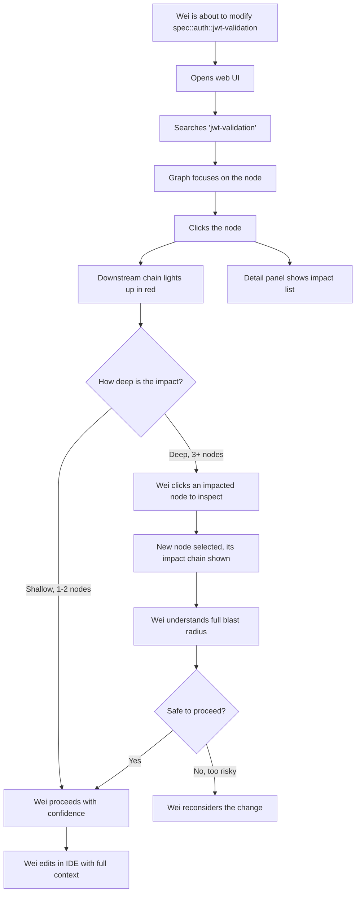
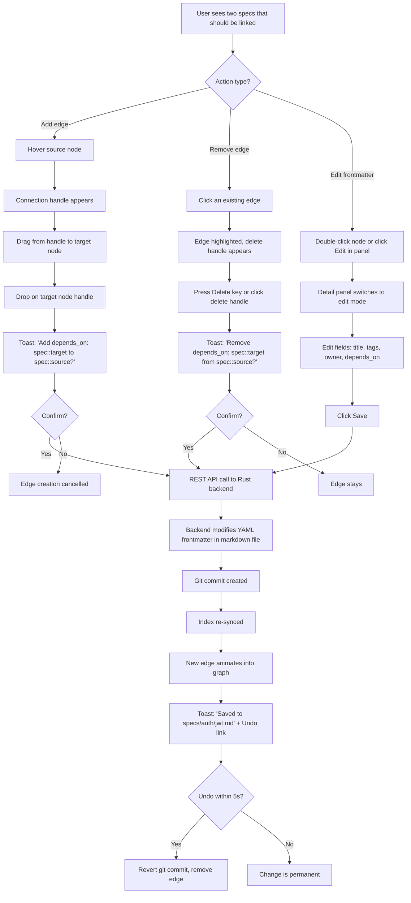
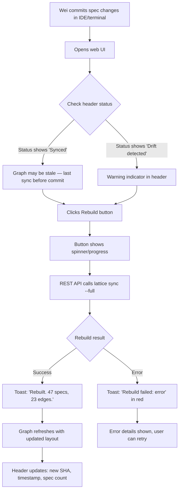

# UX Design Specification lattice

**Author:** Jack
**Date:** 2026-02-23

---

## Executive Summary

### Project Vision

lattice is a causal specification database for AI agent teams (100% Rust, CLI + MCP). This UX design defines a **web-based causal graph UI** served directly by lattice itself. The interface lets spec authors and architects **visually explore the causal graph**, inspect node details, make simple edits to specs and relationships, trigger rebuilds, and write changes back to git.

This is not a full-featured editor — it's a **graph-first exploration and light-editing tool** that makes the causal knowledge graph tangible and actionable for humans.

### Target Users

| User | Role in the UI | Tech Level | Primary Goal |
|------|---------------|------------|-------------|
| **Spec Author (Wei)** | Primary | Senior dev, comfortable with CLI | Visualize how specs relate, quick-edit frontmatter and `depends_on`, verify graph structure after authoring |
| **Architect (Mei)** | Primary | Tech lead | Explore full graph topology, identify disconnected clusters, validate architectural coherence, trigger rebuilds |
| AI Agents | Not a UI user | — | Continue using MCP tools; UI is human-only |

**Device context:** Desktop browser (developer workstation). No mobile requirements. Likely used alongside IDE and terminal.

### Key Design Challenges

1. **Graph visualization at scale** — Hundreds of nodes with causal edges. Must remain readable and navigable without becoming a hairball. Layout algorithm selection is critical.
2. **Git write-back complexity** — Edits in the UI must modify markdown files and reflect in git. This creates a round-trip: UI → modify file → git commit → re-sync indexes. Must feel instant despite the pipeline.
3. **Simplicity vs. power** — Users are technical but the UI should not feel like a database admin panel. Graph exploration should be intuitive; editing should be minimal and focused (frontmatter fields, edge add/remove).
4. **Serving from Rust** — The web UI is served by the lattice binary itself. This constrains the frontend stack (likely static assets bundled into the binary, no separate frontend deployment).

### Design Opportunities

1. **Visual impact tracing** — When a user selects a node, highlight the downstream causal chain (`trace_impact` visualized). This is the "aha moment" — seeing blast radius as a visual overlay on the graph.
2. **Disconnected cluster detection** — Color-code or spatially separate specs with no causal edges. Makes `graph://overview`'s "disconnected clusters" immediately visible and actionable.
3. **One-click rebuild** — A prominent button to trigger `sync` or `rebuild`, with live status feedback. Removes the need to switch to terminal for admin actions.
4. **Node detail panel** — Click a node → slide-out panel shows spec content, metadata, and all inbound/outbound edges. Edit directly from this panel without navigating away from the graph.

## Core User Experience

### Defining Experience

The core interaction loop is **Select → Inspect → Understand → Edit**:

1. **Select** — User clicks a node on the causal graph, or searches by name/tag to focus on a specific spec
2. **Inspect** — A detail panel slides open showing the spec's frontmatter, causal edges (inbound/outbound), and a preview of content
3. **Understand** — The graph highlights the downstream impact chain automatically — the user sees the blast radius without any extra action
4. **Edit** — User modifies a frontmatter field (e.g., adds a `depends_on` entry), saves, and the change writes back to the markdown file in git

The **primary action is exploration** — most sessions are read-only graph browsing. Editing is secondary but must be frictionless when needed.

### Platform Strategy

| Decision | Choice | Rationale |
|----------|--------|-----------|
| Platform | Web (desktop browser only) | Developer workstation context; served by lattice binary |
| Serving | Static assets embedded in Rust binary | Zero separate deployment; `lattice serve` serves both MCP and web UI |
| Input | Mouse + keyboard | No touch; developers use mouse for graph, keyboard for search/shortcuts |
| Offline | Not required | lattice runs locally — "offline" by design (localhost) |
| Frontend stack | Vanilla JS + lightweight graph library | Minimize build complexity; bundled as static assets into the binary |

### Effortless Interactions

| Interaction | Must Feel Effortless |
|-------------|---------------------|
| **Graph navigation** | Pan, zoom, scroll — immediate response, no lag. Mousewheel zoom, click-drag pan. |
| **Node selection** | Single click → detail panel appears instantly. No loading spinners for local data. |
| **Impact visualization** | Selecting a node automatically highlights its downstream chain. No extra button needed. |
| **Search-to-focus** | Type a spec name or tag → graph animates to center on matching nodes. Instant filter. |
| **Rebuild** | One button labeled "Rebuild". Shows progress. Graph refreshes when complete. |
| **Save edits** | Edit a frontmatter field → click Save → written to git. Confirmation toast, not a modal. |

### Critical Success Moments

| Moment | What Happens | Why It Matters |
|--------|-------------|----------------|
| **First graph load** | Full causal graph renders with clear layout, nodes are readable | User decides in 3 seconds if this tool is worth using |
| **First impact trace** | Click a node → downstream chain lights up in a contrasting color | The "aha" moment — blast radius is now visible, not abstract |
| **First disconnected cluster** | Orphaned specs are visually distinct (dimmed, separated) | Architect immediately sees gaps in the architecture |
| **First edit round-trip** | Change `depends_on` → Save → see graph edge appear in real-time | Proves the UI is not just a viewer — it's actionable |
| **First rebuild** | Click Rebuild → progress indicator → graph refreshes cleanly | Trust that the tool stays in sync with git |

### Experience Principles

1. **Graph-first, always** — The graph is the primary view. Everything else (detail panel, edit forms, status) is secondary UI that supports graph exploration. Never take the user away from the graph.
2. **Zero-click insight** — Selecting a node should reveal its full context (edges, impact, metadata) without requiring additional actions. Information density over interaction depth.
3. **Light touch editing** — Editing is a surgical tool, not a workshop. Frontmatter fields only. No markdown editor. No spec creation. The UI augments the CLI/editor workflow, it doesn't replace it.
4. **Instant feedback** — Every action (select, search, save, rebuild) has immediate visual feedback. Local data means no network latency excuses. Sub-100ms response for all interactions.
5. **Developer-native aesthetic** — Dark theme default. Monospace for IDs and code. No marketing polish — functional, information-dense, keyboard-accessible.

## Desired Emotional Response

### Primary Emotional Goals

**Clarity** is the dominant emotion — "I can finally *see* how everything connects." The causal graph transforms abstract YAML `depends_on` declarations into a tangible, navigable picture. Users should feel they understand their architecture better after 30 seconds with the UI than after reading spec files for 30 minutes.

**Secondary goals:** Confidence (in control of navigation), Trust (data is current), Accomplishment (found what I was looking for).

### Emotional Journey Mapping

| Moment | Target Feeling | Design Lever |
|--------|---------------|-------------|
| First graph load | Impressed but not overwhelmed | Clean layout, readable labels, no visual noise |
| Exploring nodes | In control, confident | Smooth pan/zoom, instant response, predictable interactions |
| Impact trace highlight | Revelation — "I didn't know that was connected" | Bold color contrast on causal chains, satisfying animation |
| Finding disconnected clusters | Trust — "Good catch" | Clear visual distinction for orphaned nodes |
| Editing a field | No friction — "That was easy" | Inline editing, instant save confirmation |
| Rebuild | Patience rewarded — "It's working" | Progress indicator, clean graph refresh |
| Error/failure | Informed, not anxious — "I know what went wrong" | Clear error messages, never a blank screen |

### Micro-Emotions

| Cultivate | Prevent |
|-----------|---------|
| **Confidence** → "I understand the architecture" | **Confusion** → "What am I looking at?" |
| **Trust** → "This data is current and accurate" | **Skepticism** → "Is this out of sync with git?" |
| **Accomplishment** → "Found the dependency I needed" | **Frustration** → "I can't find the node I need" |

### Design Implications

| Emotional Goal | UX Design Approach |
|---------------|-------------------|
| Clarity | Force-directed layout with cluster separation; readable node labels (title, not just ID); edge labels for relationship types |
| Confidence | Sub-100ms response on all interactions; no loading spinners for local data; keyboard shortcuts for power users |
| Trust | Last-sync timestamp always visible in header; git commit SHA displayed; stale-data warning if drift detected |
| No overwhelm | Progressive disclosure — graph shows nodes and edges; detail only on click; search filters to reduce visible nodes |
| No anxiety on edit | Toast confirmation on save ("Written to `specs/auth/jwt.md`"); undo option for 5 seconds after save |

### Emotional Design Principles

1. **Clarity over beauty** — Every visual decision serves comprehension. No decorative elements. If a visual doesn't help the user understand the graph, remove it.
2. **Trust through transparency** — Always show sync status, last commit SHA, and data freshness. Never hide system state from the user.
3. **Confidence through responsiveness** — Instant feedback on every interaction. Lag destroys the feeling of control. Local data = no excuses.
4. **Calm errors** — Errors are informational, not alarming. Show what happened, what it means, and what to do next. Never a raw stack trace or blank screen.

## UX Pattern Analysis & Inspiration

### Inspiring Products Analysis

**1. Node-RED (Flow Editor)**
- **What it does well:** Drag-and-drop node connections directly on canvas. Wires between nodes are first-class interactive elements — click to create, drag to reroute, click to delete. Double-click a node to edit properties inline.
- **Key UX pattern:** Canvas-first editing. The graph IS the editor. No separate "edit mode" — you're always editing.
- **Relevance to lattice:** The `depends_on` edge creation/deletion should feel like wiring nodes in Node-RED — drag from one node to another to create a causal link.

**2. Draw.io (diagrams.net)**
- **What it does well:** Direct manipulation of both nodes and edges on canvas. Hover a node → connection points appear → drag to create edge. Select edge → delete key to remove. Double-click node label to edit inline.
- **Key UX pattern:** Hover-reveal affordances. Connection points only appear when you hover near a node, keeping the canvas clean until you need to edit.
- **Relevance to lattice:** Hover-to-reveal connection handles for creating `depends_on` edges. Keeps the exploration view clean but editing is always one hover away.

**3. Obsidian Graph View (for exploration baseline)**
- **What it does well:** Force-directed graph of markdown files with relationships. Smooth zoom, pan, search-to-highlight. Clusters emerge naturally from the layout. Click node → opens the note.
- **Key UX pattern:** Read-first graph with progressive detail. The default experience is exploration; editing happens in context.
- **Relevance to lattice:** The exploration/navigation feel — pan, zoom, search-to-focus — should match Obsidian's smoothness. But we go further by enabling on-canvas editing.

### Transferable UX Patterns

**Navigation Patterns:**
- **Pan/zoom canvas** (Obsidian, draw.io) — mousewheel zoom, click-drag pan, minimap for orientation in large graphs
- **Search-to-focus** (Obsidian) — type spec name → graph animates to center on that node, dimming unrelated nodes

**Interaction Patterns:**
- **Drag-to-connect** (Node-RED, draw.io) — hover node → connection handle appears → drag to target node → creates `depends_on` edge
- **Click-to-select, double-click-to-edit** (draw.io) — single click selects and shows impact trace; double-click opens inline field editing on the node
- **Delete key removes** (draw.io) — select an edge → press Delete → removes the `depends_on` relationship
- **Inline label editing** (draw.io) — double-click a node's title to rename inline, directly on the canvas

**Visual Patterns:**
- **Hover-reveal affordances** (draw.io) — connection points hidden until hover, keeping the default view clean
- **Edge animations on creation** (Node-RED) — new edges animate into place, confirming the action visually
- **Cluster separation** (Obsidian) — force-directed layout naturally groups connected nodes, making architecture visible

### Anti-Patterns to Avoid

| Anti-Pattern | Why It Fails | How We Avoid It |
|-------------|-------------|-----------------|
| **Modal edit dialogs** | Breaks flow, takes user away from graph context | Inline editing directly on canvas; side panel for detail, never a modal |
| **Separate "edit mode" toggle** | Users forget which mode they're in; creates confusion | Always editable — single click = select/explore, double-click = edit, drag = connect |
| **Spaghetti graph with no layout control** | Overwhelm at scale; users can't find anything | Force-directed layout with manual pin support; search-to-focus; tag-based filtering |
| **Auto-save without confirmation** | Anxiety about unintended changes writing to git | Explicit Save button with toast confirmation; 5-second undo window |
| **Tiny, unlabeled nodes** | Useless at a glance; forces click-to-read | Node labels show title (not just ID); minimum node size enforced |

### Design Inspiration Strategy

**Adopt directly:**
- Drag-to-connect edge creation from Node-RED/draw.io — this IS the core editing interaction
- Hover-reveal connection handles from draw.io — clean canvas with editing always one hover away
- Pan/zoom/search trifecta from Obsidian — proven graph navigation

**Adapt for lattice:**
- Node-RED's property panel → our slide-out detail panel (frontmatter fields, not arbitrary properties)
- Draw.io's inline label editing → limited to `title` and `tags` fields only (not free-form text on canvas)
- Obsidian's force-directed layout → add cluster separation for disconnected specs and tag-based coloring

**Avoid:**
- Neo4j Browser's query-first approach — our users explore visually, not via query language
- Figma's infinite canvas complexity — we have a fixed, finite set of nodes; no free-form drawing needed
- Any tool that requires a separate "edit mode" toggle

## Design System Foundation

### Design System Choice

**Svelte + Svelte Flow (@xyflow/svelte)** as the complete frontend foundation.

Svelte Flow is not just a graph library — it's the entire interaction layer. The graph canvas IS the application. Everything else (detail panels, forms, toasts) is built with standard Svelte components and minimal CSS.

### Rationale for Selection

| Factor | Svelte Flow Advantage |
|--------|----------------------|
| **On-graph editing** | Built-in drag-to-connect, edge reconnection, node drag — exactly what Jack requested |
| **Custom nodes** | Svelte components as nodes — can embed spec title, tags, version directly on the node |
| **Built-in plugins** | MiniMap, Controls (zoom/fit), Background (dot grid), Panel — zero custom work needed |
| **Node Toolbar** | Built-in floating toolbar per node — perfect for inline edit/delete actions |
| **Edge labels** | Native edge label support — can show relationship types (`depends_on`, `constrains`) |
| **Dark mode** | Built-in `colorMode` prop with CSS variable theming |
| **Performance** | Svelte's compile-time approach + Svelte Flow handles hundreds of nodes smoothly |
| **MIT licensed** | No licensing concerns for embedding in lattice |
| **Active maintenance** | xyflow team (also maintains React Flow) — 53K weekly installs, regular updates |

### Implementation Approach

| Decision | Choice |
|----------|--------|
| Framework | **Svelte** (SvelteKit for build tooling) |
| Graph engine | **@xyflow/svelte** (Svelte Flow) |
| Styling | **CSS custom properties** + Svelte Flow's built-in theming |
| Build | **Vite** (via SvelteKit) → produces static assets |
| Embedding | Built static assets bundled into Rust binary via `include_dir` or similar |
| API communication | **REST/JSON** endpoints served by lattice's Rust HTTP server (same port as streamable-http MCP) |

**Build pipeline:**
```
Svelte source → Vite build → static HTML/JS/CSS → embedded in Rust binary at compile time
```

### Customization Strategy

**Custom Spec Node:** A Svelte component rendered as a Svelte Flow node, showing:
- Spec title (primary label)
- Spec ID (monospace, secondary)
- Tags (colored pills)
- Version badge
- Connection handles (source/target) for `depends_on` edges
- Node Toolbar with Edit/Impact Trace buttons on hover

**Custom Edge:** Labeled edge showing relationship type (`depends_on`), with:
- Directional arrow (source → target)
- Delete handle on hover
- Reconnect anchors for drag-to-reroute

**Theme:** Dark mode default via Svelte Flow's `colorMode="dark"`, with CSS custom properties for lattice-specific colors (node types, impact highlight, disconnected cluster dimming).

## Defining Experience

### The Defining Interaction

**"Click a spec → see its blast radius light up across the graph."**

`trace_impact` made visual. Users click any spec node and instantly see the downstream causal chain highlighted across the entire graph. Combined with on-canvas edge editing, this transforms specification management from a text-file exercise into a visual, interactive discipline.

### User Mental Model

Developers already think in dependency graphs (Cargo.toml, package.json, import trees). lattice's graph UI maps directly to this mental model, but at the specification level rather than code level. The key insight: developers understand directed edges intuitively — they just lack a tool that makes spec-level causal edges visible and editable.

**Current workaround:** Read YAML frontmatter `depends_on` fields across multiple files, mentally reconstruct the chain. Error-prone, invisible, no overview.

**New model:** Click → see → understand → edit — all on one canvas.

### Success Criteria

| Criteria | Measurement |
|----------|-------------|
| Impact trace is immediately clear | User identifies blast radius within 2 seconds of clicking a node |
| Graph layout is readable | No overlapping labels at default zoom; clusters visually separated |
| Edge creation is intuitive | First-time user successfully creates a `depends_on` edge without instructions |
| Git round-trip is invisible | Edit → save → git commit happens in < 2 seconds, user never sees git internals |
| Undo provides safety | 5-second undo window prevents anxiety about accidental changes |

### Novel UX Patterns

| Pattern | Novelty | User Education Needed |
|---------|---------|----------------------|
| Visual `trace_impact` | Novel for specs | None — clicking a node is intuitive; highlighting is self-explanatory |
| Drag-to-connect `depends_on` | Established pattern, novel context | Minimal — connection handles on hover are a known affordance (Node-RED, draw.io) |
| Canvas edit → git write-back | Novel | Toast notification explains what happened ("Written to `specs/auth/jwt.md`") |
| Force-directed spec layout | Established | None — users expect graph layout algorithms |

### Experience Mechanics

**1. Initiation (Graph Load)**
- Svelte Flow canvas renders all specs as custom nodes with title, ID, tags
- Force-directed layout via dagre/elkjs positions nodes
- Disconnected specs dimmed with reduced opacity
- Header shows: sync status, git SHA, spec count, search bar, Rebuild button

**2. Exploration (Node Selection)**
- Single click selects node → downstream chain highlights in accent color, upstream in secondary color
- Detail panel slides in from right: full spec metadata + markdown preview
- Node Toolbar appears: `[Edit] [Trace Impact] [Open in Editor]`

**3. Editing (On-Canvas)**
- Hover node → Svelte Flow connection handles appear
- Drag handle to target → edge created → confirmation toast
- Double-click node → frontmatter fields become editable inline in detail panel
- Delete key on selected edge → removes `depends_on` relationship
- All edits trigger: REST API → Rust backend → modify markdown YAML → git commit → re-sync

**4. Completion (Feedback)**
- Toast: "Saved. Written to `specs/auth/jwt-validation.md`" with 5-second undo
- Graph updates in real-time — new edges animate, impact trace refreshes
- Status bar updates sync timestamp

## Visual Design Foundation

### Color System

**Graph-Optimized Dark Theme** — navy base with high-contrast accent colors for graph state visualization.

| Token | Color | Usage |
|-------|-------|-------|
| `--bg-canvas` | `#1a1a2e` | Svelte Flow canvas background |
| `--bg-surface` | `#16213e` | Detail panel, header background |
| `--bg-node` | `#0f3460` | Default spec node background |
| `--text-primary` | `#e0e0e0` | Node titles, body text |
| `--text-secondary` | `#8899aa` | Spec IDs, timestamps, secondary info |
| `--accent-impact` | `#e94560` | Downstream impact trace highlight (bold red) |
| `--accent-upstream` | `#5c7cfa` | Upstream dependency highlight (calmer blue) |
| `--accent-edge` | `#4a6fa5` | Default edge color |
| `--accent-success` | `#2ecc71` | Save confirmation toasts |
| `--accent-warning` | `#f39c12` | Stale data warning, drift detection |
| `--accent-error` | `#e74c3c` | Error states |
| `--disconnected` | `#3a3a5c` at 40% opacity | Orphaned/disconnected spec nodes |
| `--tag-pill` | Various pastels | Tag-based node categorization |

**Design rationale:** Navy base provides calm, professional canvas for extended graph exploration. Red impact trace creates immediate visual separation for blast radius. Blue upstream is visually distinct from red downstream (directional clarity).

### Typography System

| Element | Font | Size | Weight |
|---------|------|------|--------|
| Node title | System sans-serif | 14px | 600 |
| Spec ID | `monospace` | 11px | 400 |
| Tags | System sans-serif | 10px | 500 |
| Detail panel headings | System sans-serif | 16px | 600 |
| Detail panel body | System sans-serif | 14px | 400 |
| Status bar / git SHA | `monospace` | 12px | 400 |

**Rationale:** System fonts for zero load time and native feel. Monospace for spec IDs and git SHAs — these are code identifiers. No custom font loading required.

### Spacing & Layout Foundation

**Spacing scale (4px base):**

| Token | Value | Usage |
|-------|-------|-------|
| `--space-xs` | 4px | Inline spacing (tag pill gaps) |
| `--space-sm` | 8px | Node internal padding |
| `--space-md` | 16px | Panel sections, form gaps |
| `--space-lg` | 24px | Section separators |

**Layout structure:**

```
┌─────────────────────────────────────────────────────┐
│ [Header] Search... | Sync: 2s ago | SHA:abc123 | ⟳ │
├──────────────────────────────────────┬──────────────┤
│                                      │              │
│         Svelte Flow Canvas           │   Detail     │
│         (fills remaining viewport)   │   Panel      │
│                                      │   (360px)    │
│  [MiniMap]              [Controls]   │              │
└──────────────────────────────────────┴──────────────┘
```

- Canvas fills 100% viewport minus header (48px) and optional panel (360px)
- Detail panel slides in from right on node selection, pushes canvas
- MiniMap bottom-left, Controls bottom-right (Svelte Flow built-ins)
- Node minimum width: 180px, internal padding: 12px

### Accessibility Considerations

| Requirement | Implementation |
|-------------|---------------|
| Color contrast (WCAG AA) | All text/background pairs ≥ 4.5:1 ratio. Impact red on navy = 5.2:1 ✓. Primary text on surface = 9.1:1 ✓ |
| Keyboard navigation | Svelte Flow built-in: arrow keys move nodes, Enter/Space to select, Delete to remove |
| Focus indicators | Visible focus ring on all interactive elements (nodes, buttons, form fields) |
| Screen reader | Svelte Flow's `ariaLabel` config for node/edge descriptions |
| No color-only communication | Impact trace uses color + animated edge flow; disconnected uses opacity + spatial separation |

## Design Direction Decision

### Design Directions Explored

Three directions evaluated via interactive HTML mockup (`ux-design-directions.html`):

| Direction | Approach | Strengths | Weaknesses |
|-----------|----------|-----------|------------|
| **A: Clean Canvas** | Floating translucent chrome, overlay detail card | Maximum graph real estate, immersive | Floating UI feels unanchored; overlay may obscure nodes |
| **B: Split Pane** | Fixed header, always-visible panel, status bar | Structured, IDE-familiar, predictable | Panel wastes space during browse-only sessions |
| **C: Hybrid** | Thin header, full canvas default, slide-in panel | Best of both worlds — canvas-first with structure on demand | Slight layout shift on panel open |

### Chosen Direction

**Direction C: Hybrid** — canvas-first with slide-in detail panel.

- Full Svelte Flow canvas by default (no panel visible)
- Thin fixed header (40px): logo, search, sync status, rebuild button
- Clicking a node slides in a 360px detail panel from the right, pushing the canvas
- Dismissing the panel returns to full-canvas mode
- MiniMap (bottom-left) and Controls (bottom-right) as Svelte Flow overlays
- Toast notifications for save confirmations anchored to bottom-center

### Design Rationale

1. **Graph-first principle** — Direction C gives the graph 100% of the viewport until the user explicitly requests detail. A and B both sacrifice canvas space permanently.
2. **Draw.io/Figma precedent** — The slide-in panel pattern is proven in canvas-first tools. Users expect panels to appear contextually and dismiss cleanly.
3. **Minimal chrome** — The 40px header is the thinnest of all three directions. Every pixel saved for the graph matters at scale (hundreds of nodes).
4. **No wasted space** — Unlike B's always-visible panel, C's panel only appears when useful. Browse-only sessions get maximum canvas.
5. **Push, not overlap** — The panel pushes the canvas rather than overlapping it (unlike A's floating card). No nodes hidden behind UI elements.

### Implementation Approach

| Component | Implementation |
|-----------|---------------|
| Header | Standard Svelte component, fixed position, 40px height |
| Graph Canvas | `<SvelteFlow>` component, fills remaining viewport, responds to panel state |
| Detail Panel | Svelte component with CSS transition (`transform: translateX`), 360px width |
| Panel trigger | Svelte Flow `on:nodeclick` event → set `selectedNode` store → panel slides in |
| Panel dismiss | Close button or click canvas background → clear `selectedNode` → panel slides out |
| Canvas resize | CSS `margin-right` transition synced with panel slide animation |
| Toast system | Absolute-positioned component, bottom-center, auto-dismiss after 5 seconds |
| MiniMap | `<MiniMap>` Svelte Flow component, bottom-left |
| Controls | `<Controls>` Svelte Flow component, bottom-right |

## User Journey Flows

### Journey 1: Explore & Understand the Graph

**User:** Wei or Mei — first time opening the web UI, or returning to review architecture.

**Goal:** Understand the full spec landscape and find specific specs.



**Key interactions:**
- **Entry:** Navigate to `localhost:{port}` in browser
- **Graph load:** < 1 second, force-directed layout via dagre/elkjs
- **Search:** `Ctrl+K` or click search bar → type → graph filters in real-time
- **Node click:** Single click = select + highlight impact chain + open panel
- **Dismiss:** Click canvas background or panel close button

### Journey 2: Trace Impact Before a Change

**User:** Wei — about to modify a spec, wants to see what's affected first.

**Goal:** Understand the full blast radius of a spec before editing it in his IDE.



**Key interactions:**
- **Search-to-focus:** Typing immediately filters the graph
- **Impact chain:** Automatic on selection — no extra button needed
- **Depth exploration:** Click any highlighted (impacted) node to see ITS impact chain
- **Info stays visible:** Detail panel shows full dependency list as text alongside visual highlights

### Journey 3: Edit Spec Relationships on Canvas

**User:** Wei or Mei — needs to add/remove a `depends_on` relationship.

**Goal:** Modify a spec's causal edges directly on the graph, write back to git.



**Key interactions:**
- **Drag-to-connect:** Hover → handle appears → drag to target (Node-RED/draw.io pattern)
- **Confirmation toast:** Always confirm before git write-back — no auto-save
- **5-second undo:** Safety net for accidental changes
- **Delete edge:** Select edge → Delete key (draw.io pattern)
- **Edit frontmatter:** Double-click node or Edit button in panel → inline form fields

### Journey 4: Rebuild & Monitor Sync Status

**User:** Wei — ran `git commit` after editing specs in his IDE, needs to re-sync the graph.

**Goal:** Trigger a rebuild and verify the graph is current.



**Key interactions:**
- **Rebuild button:** Always visible in header, single click
- **Progress feedback:** Button spinner during rebuild (< 5 seconds for 100+ specs)
- **Status transparency:** Header always shows last sync SHA + timestamp
- **Drift warning:** If startup consistency check detects drift, header shows warning badge

### Journey Patterns

| Pattern | Used In | Implementation |
|---------|---------|---------------|
| **Search-to-focus** | J1, J2 | `Ctrl+K` → type → graph filters and centers |
| **Click-to-inspect** | J1, J2, J3 | Single click = select + highlight + panel |
| **Confirm-before-write** | J3 | Toast with confirm/cancel before git commit |
| **Undo window** | J3 | 5-second undo link in success toast |
| **Progress feedback** | J4 | Button spinner → success/error toast |
| **Status transparency** | J1, J4 | Header always shows sync state + SHA |

### Flow Optimization Principles

1. **Minimum clicks to value:** Graph loads → click node → see impact. Two interactions from open to insight.
2. **No mode confusion:** Single click always selects. Double-click always edits. Drag always connects. No toggle between "view mode" and "edit mode."
3. **Confirm destructive, skip safe:** Graph exploration needs zero confirmation. Git writes always confirmed. Delete always confirmed.
4. **Error recovery is always one action:** Undo toast for edits. Rebuild button for sync issues. Close panel to reset view.

## Component Strategy

### Svelte Flow Built-in Components

| Component | Usage | Customization Needed |
|-----------|-------|---------------------|
| `<SvelteFlow>` | Main canvas container | Configure: `colorMode="dark"`, event handlers, connection validation |
| `<MiniMap>` | Bottom-left orientation map | Style: match dark theme colors |
| `<Controls>` | Bottom-right zoom +/-/fit | Style: match dark theme |
| `<Background>` | Dot grid pattern | Configure: `variant="dots"`, match `--bg-canvas` |
| `<Handle>` | Connection points on nodes | Style: show on hover only |
| `<NodeToolbar>` | Per-node action buttons | Content: Edit / Trace Impact buttons |
| `<EdgeLabel>` | Relationship type on edges | Content: "depends_on" label |
| `<EdgeReconnectAnchor>` | Drag to reroute edge endpoints | Default behavior sufficient |

### Custom Components

**1. SpecNode** (Custom Svelte Flow Node)

| Aspect | Specification |
|--------|--------------|
| **Purpose** | Render a spec as an interactive graph node |
| **Anatomy** | Title (semibold 14px) → ID (monospace 11px) → Tag pills (10px) |
| **States** | `default` (blue bg), `selected` (red border + glow), `impact` (red tint), `upstream` (blue tint), `disconnected` (dimmed 40%) |
| **Handles** | Top (target) + Bottom (source), visible on hover only |
| **Size** | Min-width: 180px, padding: 12px |
| **Accessibility** | `aria-label="{title} spec node"`, focusable, arrow-key navigable |

**2. CausalEdge** (Custom Svelte Flow Edge)

| Aspect | Specification |
|--------|--------------|
| **Purpose** | Render a `depends_on` relationship between specs |
| **Anatomy** | Bezier path + directional arrow + "depends_on" label |
| **States** | `default` (accent-edge color), `impact` (red + glow + animated dash), `upstream` (blue), `selected` (highlighted + delete handle visible) |
| **Interactions** | Click to select, Delete key to remove, hover shows reconnect anchors |
| **Accessibility** | `aria-label="depends on {target}"` |

**3. DetailPanel**

| Aspect | Specification |
|--------|--------------|
| **Purpose** | Show spec details and edit frontmatter on node selection |
| **Anatomy** | Close button → Title → Spec ID → Metadata section → Tags → Dependencies (upstream) → Impact (downstream) → Action buttons |
| **States** | `hidden` (off-screen right), `visible` (slides in 360px), `editing` (fields become input/select controls) |
| **Modes** | **View mode:** Read-only display. **Edit mode:** Triggered by Edit button or double-click node. Shows form fields for title, tags, owner, depends_on |
| **Transitions** | Slide in/out: 300ms ease CSS transform |
| **Accessibility** | Focus trap when open, Escape to close, tab order through fields |

**4. HeaderBar**

| Aspect | Specification |
|--------|--------------|
| **Purpose** | Persistent top bar with search, status, and admin actions |
| **Anatomy** | Logo ("lattice") → Search input → Spacer → Sync status (monospace) → Rebuild button |
| **Height** | 40px fixed |
| **Search** | `Ctrl+K` shortcut to focus, real-time filter as user types |
| **Status display** | `{count} specs · {SHA:7} · {time} ago` — updates after rebuild |
| **Rebuild button** | Default: "⟳ Rebuild". During rebuild: spinner. Post-rebuild: success/error toast |
| **Drift warning** | Orange warning badge next to status when cross-store drift detected |

**5. ToastNotification**

| Aspect | Specification |
|--------|--------------|
| **Purpose** | Non-blocking feedback for save, rebuild, and error actions |
| **Anatomy** | Icon (✓/✕/⚠) → Message → Optional action link (Undo) |
| **Variants** | `success` (green), `error` (red), `warning` (orange), `info` (blue) |
| **Position** | Bottom-center, 24px from edge |
| **Behavior** | Auto-dismiss after 5 seconds. Undo link cancels the action if clicked within window. Stack up to 3 toasts vertically. |
| **Accessibility** | `role="status"`, `aria-live="polite"` |

**6. SearchFilter**

| Aspect | Specification |
|--------|--------------|
| **Purpose** | Filter graph nodes by name, ID, or tag |
| **Trigger** | `Ctrl+K` or click search input in header |
| **Behavior** | As user types, non-matching nodes dim (opacity 0.2), matching nodes stay full opacity. Graph optionally animates to center on matches. |
| **Clear** | Escape key or clear button restores all nodes to full opacity |
| **No results** | Text under search: "No specs match '{query}'" |

### Component Implementation Strategy

| Layer | Components | Build With |
|-------|-----------|-----------|
| **Graph layer** | SpecNode, CausalEdge | Svelte Flow custom node/edge API |
| **Chrome layer** | HeaderBar, DetailPanel | Standard Svelte components + CSS |
| **Feedback layer** | ToastNotification | Svelte component + CSS transitions |
| **Interaction layer** | SearchFilter | Svelte store + Svelte Flow node filtering |

**Shared state management:** Svelte stores for:
- `selectedNode` — drives panel visibility and impact highlighting
- `graphData` — nodes and edges from REST API
- `syncStatus` — last sync SHA, timestamp, drift state
- `toasts` — stack of active toast notifications

### Implementation Roadmap

| Phase | Components | Rationale |
|-------|-----------|-----------|
| **P1: Core graph** | SvelteFlow + SpecNode + CausalEdge + Background + MiniMap + Controls | Must render graph before anything else works |
| **P2: Inspection** | HeaderBar + DetailPanel (view mode) + SearchFilter | Enable exploration (Journey 1 & 2) |
| **P3: Editing** | DetailPanel (edit mode) + drag-to-connect + edge delete + ToastNotification | Enable on-canvas editing (Journey 3) |
| **P4: Admin** | Rebuild button + sync status + drift warning | Enable rebuild flow (Journey 4) |

## UX Consistency Patterns

### Interaction Patterns

Every mouse/keyboard action has ONE consistent meaning across the entire application:

| Input | Meaning | Everywhere |
|-------|---------|-----------|
| **Single click** | Select / inspect | Node: select + highlight impact + open panel. Edge: select + show delete handle. Canvas: deselect all, close panel. |
| **Double-click** | Edit | Node: enter edit mode in detail panel. Canvas: no action. |
| **Hover** | Preview affordance | Node: show connection handles. Edge: show reconnect anchors + delete handle. Button: show tooltip. |
| **Drag (from handle)** | Create connection | Drag from node handle → drop on target handle → create `depends_on` edge |
| **Drag (from node body)** | Move node | Reposition node on canvas (Svelte Flow default) |
| **Drag (from canvas)** | Pan | Pan the viewport (Svelte Flow default) |
| **Mousewheel** | Zoom | Zoom in/out on cursor position (Svelte Flow default) |
| **Delete key** | Remove selected | Selected edge: remove `depends_on`. Selected node: no action (specs aren't deleted from UI). |
| **Escape** | Cancel / dismiss | Close detail panel. Cancel drag-to-connect. Clear search filter. Exit edit mode. |
| **Ctrl+K** | Search | Focus search input in header |
| **Ctrl+Z** | Undo | Undo last git write-back (if within 5-second undo window) |

### Button Hierarchy

| Level | Style | Usage |
|-------|-------|-------|
| **Primary** | Solid `--accent-upstream` background, white text | One per context: "Edit" in panel, "Rebuild" in header |
| **Secondary** | Transparent background, `--text-primary` text, 1px border | Supporting actions: "Open in Editor", "Trace Impact" |
| **Destructive** | Transparent background, `--accent-error` text, 1px border | Delete edge confirmation, discard edits |
| **Ghost** | No border, `--text-secondary` text | Panel close button, toast dismiss |

**Rule:** Maximum ONE primary button visible per UI region (header, panel, toolbar). Never two primary buttons competing for attention.

### Feedback Patterns

| Event | Feedback Type | Duration | Content Pattern |
|-------|--------------|----------|-----------------|
| **Save success** | Toast (success, green) | 5s auto-dismiss | "✓ Saved to `{filepath}`" + Undo link |
| **Edge created** | Toast (success, green) | 5s auto-dismiss | "✓ Added `depends_on: {target}` to `{source}`" + Undo link |
| **Edge removed** | Toast (success, green) | 5s auto-dismiss | "✓ Removed `depends_on: {target}` from `{source}`" + Undo link |
| **Rebuild success** | Toast (info, blue) | 5s auto-dismiss | "✓ Rebuilt. {N} specs, {M} edges." |
| **Rebuild error** | Toast (error, red) | Manual dismiss | "✕ Rebuild failed: {error message}" |
| **Drift detected** | Header badge (warning, orange) | Persistent until rebuild | Orange dot + "Drift" label next to sync status |
| **Save error** | Toast (error, red) | Manual dismiss | "✕ Failed to write: {error}" |
| **Search no results** | Inline text | While search active | "No specs match '{query}'" below search input |

### Form Patterns (Detail Panel Edit Mode)

| Pattern | Implementation |
|---------|---------------|
| **Field layout** | Label above input, full width within panel |
| **Text input** | `title`, `owner` — single-line input, dark bg (`rgba(255,255,255,0.06)`), 1px border |
| **Tag input** | `tags` — pill display + text input to add. Click pill × to remove. |
| **Dependency input** | `depends_on` — list of spec IDs as monospace pills. "Add dependency" button opens dropdown of available spec IDs. Click × to remove. |
| **Validation** | Inline below field. Red text for errors ("Spec ID not found"). No modal alerts. |
| **Save** | Primary button "Save" at bottom. Disabled until changes detected. |
| **Cancel** | Secondary button "Cancel" next to Save. Reverts all unsaved changes. |
| **Unsaved indicator** | Dot indicator on panel title when unsaved changes exist |

### State Patterns

| State | Visual Treatment | User Action |
|-------|-----------------|-------------|
| **Loading (graph)** | Canvas with dot background + centered spinner + "Loading graph..." | Wait (< 1 second) |
| **Empty (no specs)** | Canvas with centered message: "No specs found. Run `lattice init` to get started." | Follow CLI instructions |
| **Error (graph load)** | Canvas with centered error: "Failed to load graph: {error}. [Retry]" | Click Retry |
| **Disconnected nodes** | Nodes at 40% opacity, visually grouped away from connected clusters | Click to inspect; add edges to connect |
| **Rebuilding** | Header rebuild button shows spinner. Graph dims slightly (opacity 0.8). | Wait (< 5 seconds) |
| **Stale/drift** | Orange warning badge in header. Graph still interactive. | Click Rebuild to resolve |
| **Search active** | Non-matching nodes dim to 20% opacity. Matching nodes full opacity. | Type to filter, Escape to clear |
| **Impact highlight** | Downstream nodes: red tint + red border. Upstream: blue tint + blue border. Edges animated. | Click different node to shift highlight |

### Keyboard Shortcuts

| Shortcut | Action | Context |
|----------|--------|---------|
| `Ctrl+K` | Focus search | Global |
| `Escape` | Dismiss/cancel | Close panel, clear search, exit edit, cancel drag |
| `Delete` | Remove selected edge | Edge selected |
| `Ctrl+Z` | Undo last write | Within 5s of save |
| `Ctrl+0` | Fit graph to viewport | Global |
| `+` / `-` | Zoom in / out | Global (when search not focused) |
| `Arrow keys` | Move selected node | Node selected |
| `Tab` | Cycle through form fields | Edit mode in panel |

## Responsive Design & Accessibility

### Responsive Strategy

**Desktop-only.** No tablet or mobile breakpoints needed.

| Decision | Rationale |
|----------|-----------|
| No mobile support | Developer workstation tool — used alongside IDE and terminal |
| No tablet support | Graph editing requires mouse precision (drag-to-connect, hover handles) |
| Minimum viewport | 1024px width × 768px height — below this, show "Desktop browser required" message |
| Large screen optimization | Graph canvas expands to fill available space; detail panel width stays fixed at 360px |

**Viewport breakpoints (desktop only):**

| Breakpoint | Layout Adjustment |
|-----------|-------------------|
| < 1024px | Show warning: "lattice requires a desktop browser (1024px+)" |
| 1024px – 1440px | Standard layout: 40px header + canvas + 360px panel |
| > 1440px | Extra canvas space; consider wider nodes or looser graph layout |

### Accessibility Strategy

**Target: WCAG 2.1 Level AA** — industry standard, appropriate for a developer tool.

**Graph-specific accessibility challenges:**

| Challenge | Solution |
|-----------|----------|
| Graph is inherently visual | Supplement with text: detail panel shows all relationships as a text list. `graph://overview` MCP resource provides text summary. |
| Drag-to-connect requires mouse | Alternative: "Add dependency" button in detail panel edit mode → dropdown of spec IDs |
| Impact highlighting is color-based | Supplement with: animated edge dashes (motion cue) + detail panel lists impact chain as text |
| Node position carries meaning (clusters) | Supplementary text in header: "{N} disconnected specs" count |

**Implemented accessibility features:**

| Feature | Implementation |
|---------|---------------|
| **Keyboard navigation** | Svelte Flow built-in: Tab to focus canvas → Arrow keys to move between nodes → Enter to select → Delete to remove edge |
| **Focus indicators** | 2px solid focus ring on all interactive elements. Focus ring color: `--accent-upstream` |
| **Color contrast** | All text pairs meet 4.5:1 minimum. Tested: primary text on surface = 9.1:1, impact red on canvas = 5.2:1 |
| **ARIA labels** | Nodes: `aria-label="{title} specification"`. Edges: `aria-label="depends on {target}"`. Panel: `aria-label="Specification details"` |
| **ARIA live regions** | Toast notifications: `aria-live="polite"`. Sync status updates: `aria-live="polite"` |
| **Focus management** | Panel open → focus moves to panel. Panel close → focus returns to previously selected node. |
| **Reduced motion** | Respect `prefers-reduced-motion`: disable edge animations, graph transitions become instant |
| **Screen reader** | Detail panel provides complete text representation of all graph data visible on canvas |

### Testing Strategy

| Test Type | Tool/Approach | Frequency |
|-----------|--------------|-----------|
| **Automated a11y** | axe-core or Lighthouse in CI | Every build |
| **Keyboard-only navigation** | Manual walkthrough of all 4 journeys using only keyboard | Each feature release |
| **Screen reader** | Test with NVDA (Windows) and VoiceOver (macOS) | Each feature release |
| **Color contrast** | Verify all color token pairs with contrast checker | When theme changes |
| **Browser testing** | Chrome, Firefox, Safari, Edge (latest versions) | Each release |

### Implementation Guidelines

**Semantic HTML:**
- Use `<nav>` for header, `<main>` for canvas area, `<aside>` for detail panel
- Use `<button>` for all clickable actions (never `<div onclick>`)
- Use `<form>` with proper `<label>` associations in edit mode

**Focus management:**
- Skip link at top: "Skip to graph canvas"
- Focus trap in detail panel when open (Tab cycles within panel)
- Escape always returns focus to canvas

**Alternative interactions (non-mouse):**
- Every drag-to-connect action has a button/dropdown alternative in the detail panel
- Every hover-reveal action also activates on keyboard focus
- Delete key works on focused/selected elements
